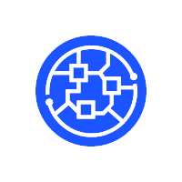
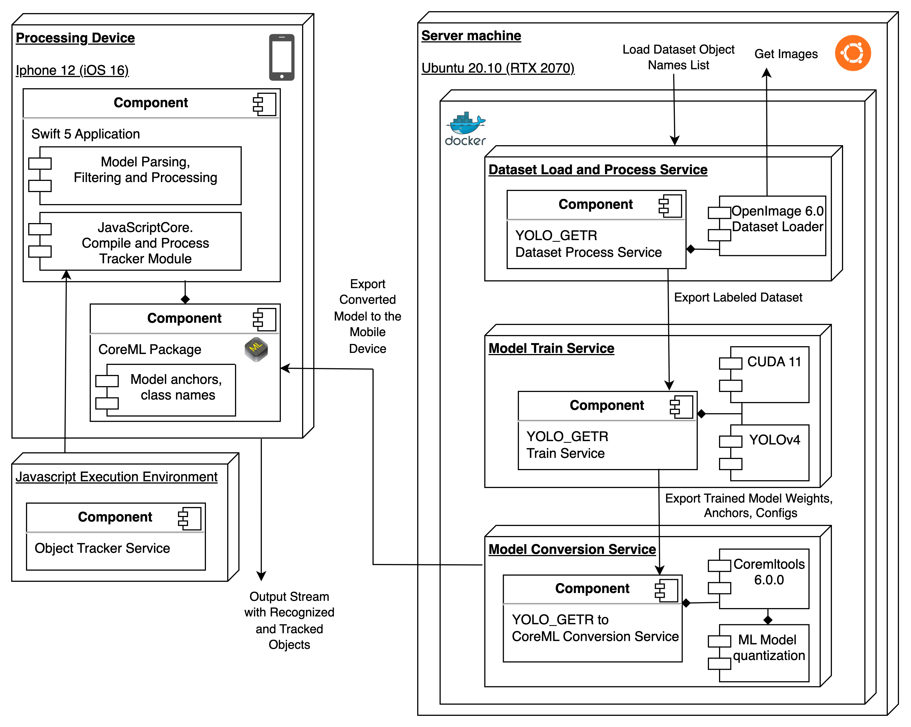
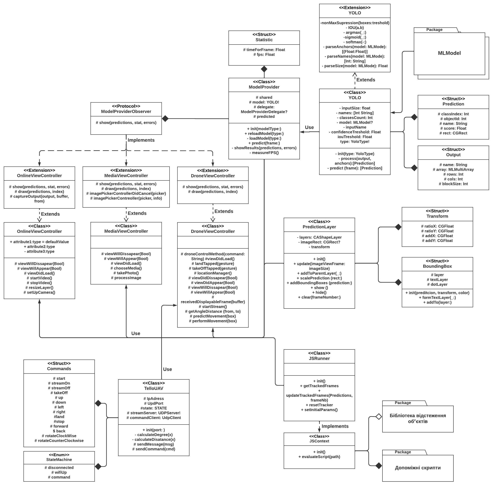

# GETR - Mobile Recognizer and Tracker.

Introducing scalable object detection and tracking tool with convolutional neural network architecture.

It consists of:

- 3 python services, wrapped into docker composition, to load, train and convert Neural Network model into CoreML format for IOS
  The steps are the follows:
  - run the image loader: <pre>docker-compose up --build images-download</pre>
  - run the train service: <pre>docker-compose up --build train-service</pre>
    (todo - create cross image volume for trained data, and pass training results to conversion service volume)
  - execute the train command inside the service: <pre>docker exec -it  --gpus all getr-network:train-service ./darknet detector train obj.data yolo-obj.cfg yolov4.conv.29 -map -dont_show </pre>
  - run the converter: <pre>docker-compose up --build conversion-service</pre>
- Swift iOS application for performing all ML (Machine Learning) tasks
- Injected Object Tracker module

# Structure Diagram

# UML Diagram of the Mobile System

